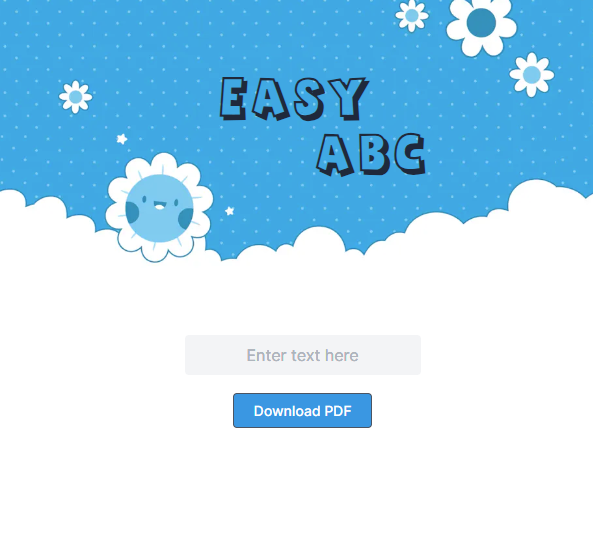

# Easy-ABC

https://easy-abc.vercel.app/

Easy-ABC is a simple web application that i designed for my 4 year old that wants to learn how to write.
As a parent you can enter any letters or words you want in the input field and get a downloadable PDF worksheet for your child to practice on.

## Techstack

The app is built with

- nextJS 14
- Tailwind CSS
- react-pdf
